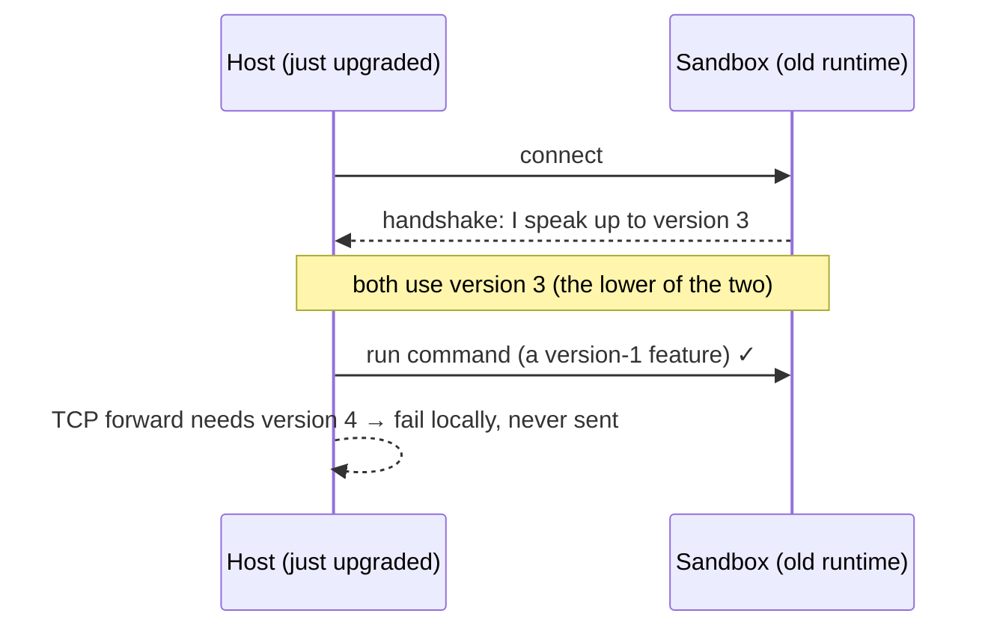
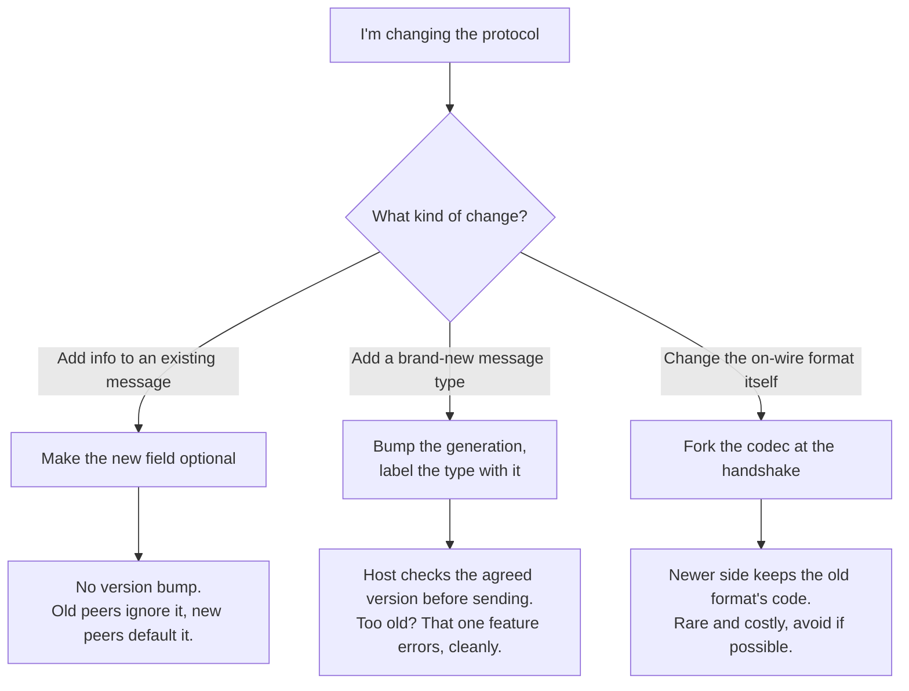

# Agent Protocol Versioning

This explains how microsandbox keeps the program inside a sandbox and the program on your
machine talking to each other, even when they were built at different times. You don't need to
know the codebase to read this. The precise, implementer-facing details are in the last section.

## The two programs, and why versioning is hard

Two programs talk over this protocol:

- **The runtime** (`agentd`) runs _inside_ the sandbox. It is built into the sandbox when the
  sandbox is created, and it never changes after that. A sandbox that has been running for a
  week is still using the runtime from a week ago.
- **The host** (the SDK / CLI on your machine) talks to that runtime. You upgrade it whenever you
  update microsandbox.

So the awkward situation is normal: **a freshly upgraded host talks to a sandbox whose runtime is
old and frozen.** We can't go back and upgrade the runtime inside a running sandbox. The protocol
has to cope with that gap.

Our goal: **the old runtime never has to understand anything new.** The newer host does all the
adapting. The connection keeps working, and if the host wants to use a brand-new feature the old
runtime simply doesn't have, _only that one feature_ fails, with a clear message. The rest of the
session carries on.

## The mental model: agreeing on a version at the start of a call

Think of two people on a phone call who each speak some version of a language. At the very start
of the call they establish the highest version they _both_ know, and they speak that for the rest
of the call. If one of them knows a newer word the other doesn't, they just don't use it.

That is exactly how this works:

- When the host connects, there's a brief **handshake**. During it, each side learns the other's
  version.
- They settle on the **lower** of the two versions and use it for the whole connection.
- A new feature is used only if the agreed version is high enough to support it.



## There is only one version number

The single version number is called the **generation**. It's just a counter that goes up by one
every time we add something to the protocol. The handshake agrees on one generation per
connection, and everything else is decided by that one number.

This is worth stating plainly because the code has two things that _look_ like separate version
numbers but aren't:

- There's a version field stamped onto every message on the wire. That is just the generation,
  written down so a message is self-describing. It is not a second version.
- Each kind of message records "the generation I was introduced in." That's a label that places
  the message on the one timeline. It is not a second version either.

One number, agreed once. Hold onto that.

## How the protocol changes without breaking older runtimes

There are three kinds of change, from easiest to hardest. Almost everything we ever do is the
first kind.



### 1. Add a new piece of information to an existing message (easy, happens all the time)

Say a "run this command" message gains an optional `timeout` field.

The rule: **new fields are always optional.** Because of that:

- A new host sends the `timeout` to an old runtime. The old runtime has never heard of `timeout`,
  so it simply ignores it. No crash.
- An old runtime sends a message _without_ a `timeout` to a new host. The new host notices it's
  missing and fills in a sensible default. No crash.

So adding fields needs no version bump at all. It just works in both directions.

One thing to decide each time: if the old runtime ignores your new field, the feature quietly does
nothing on old sandboxes (an old runtime that ignores `timeout` just runs the command with no
timeout). If that silent "nothing happens" is fine, you're done. If you'd rather the user get a
loud "your sandbox is too old for this," treat it as the next kind of change instead.

### 2. Add a brand-new kind of message (a new feature)

Say we add TCP port forwarding, which needs a new "open a TCP connection" message that older
runtimes have never seen.

Here the host checks the agreed generation _before sending_:

- If the sandbox is new enough, send it.
- If the sandbox is too old, **don't send it.** The host returns a clear error right away ("this
  sandbox is too old for TCP forwarding; recreate it to use this"), locally, without bothering the
  runtime. **Only that feature fails. The connection and everything else keep working.**

This is the key to "old runtime understands nothing new": the host never sends an old runtime
something it can't handle. It knows the runtime's version from the handshake, so it decides up
front.

### 3. Change the message format itself (rare and expensive)

The first two kinds change _what's inside_ messages. This kind changes _the shape of the
container_ every message travels in: how messages are framed and laid out on the wire.

This is the hard one, because a program has to understand the container's shape before it can read
anything inside it. You can't put "which shape is this?" inside the message, because you'd have to
already know the shape to find it. The only place to sort this out is the **handshake**, before
any normal message flows. So:

- The two sides discover the format mismatch at the handshake.
- The **newer side keeps the old format's code and uses it** to talk to the old runtime. The old
  runtime can't adapt (it only knows its own format), so the newer side does.
- We keep the old format's code around until we officially stop supporting sandboxes that old,
  then remove it in a planned release.

Because this is costly, we avoid it. We keep the container as small and stable as possible and put
almost all change into kinds 1 and 2, which never touch it.

## Who bends, and when we refuse

The pattern across all three kinds is the same: **the newer side always adapts to the older
side.** The old runtime is frozen, so it can't do anything else; all the work lives in the newer
host.

The only time a connection is refused outright is when the sandbox is _so_ old that the host no
longer carries the code to speak its format at all (because we dropped support for versions that
old). That's a clean, upfront error telling you to recreate the sandbox, not a confusing failure
mid-session.

## The rules we never break

These are the promises that make all of the above hold together:

1. **One version number** (the generation), agreed once at the handshake.
2. **The message container never changes shape.** All evolution goes inside the message, not into
   its framing.
3. **New fields are always optional**, so old and new can ignore or default what they don't know.
4. **New kinds of message are only ever added, never removed or redefined**, and each records the
   generation it arrived in.
5. **The host checks the agreed version before sending** anything new, so unsupported features
   fail cleanly and alone.
6. **The newer side speaks the older format.** The old runtime is never asked to learn anything.

## How to see what a version looked like

A fair worry about "just add optional fields forever" is that it gets hard to see what a message
_used to_ look like at, say, version 4. We solve that with a generated, checked-in file per
version (a schema snapshot) that lists every message's exact shape at that version. It's produced
automatically from the code and verified by a test, so it can never drift out of date, and when
someone bumps the version the change shows up as a simple diff in review. You get a precise
per-version reference without complicating the actual code.

## Why we don't put the version into the message types themselves

A tempting alternative is to make the message type itself carry the version (one Rust type per
version). We don't, for a few reasons: it would force an old runtime to fail on the _entire_
message rather than gracefully ignore the new parts; it would spread version-handling into every
corner of the code; and it can't even express the hardest change (the format/container one),
because that lives at a lower level than the message types. The one place a per-version type
genuinely helps is a rare _breaking_ change to a single message (a field's meaning changes, not
just a new field added). There, and only there, we introduce a distinct type for the old and new
shapes plus a small converter. We apply that narrowly, to the one message that broke, never to the
whole protocol up front.

---

## Implementation details (for contributors changing the protocol)

The wire layout, in two nested layers:

```
[ length ][ id ][ flags ]          <- fixed binary header, read first, never changes shape
CBOR { v, t, p }                   <- the envelope: version, message type, payload bytes
            p = CBOR { ...fields }  <- the payload for that message type (ExecRequest, etc.)
```

- **`v`** is the generation, echoed onto each message. Same number negotiated at the handshake;
  not a per-message version. Don't gate behavior by reading it per message.
- **`MessageType::min_protocol_version()`** (`lib/message.rs`) is the per-type label: the
  generation that introduced the type. It has no wildcard arm, so adding a `MessageType` won't
  compile until you assign its generation (and bump `PROTOCOL_VERSION` to match). Core and exec
  types are generation 1 (the pre-0.5 legacy runtime handles them); the `Fs*` types are generation
  2, because filesystem streaming did not exist in the legacy protocol.
- **The send gate** lives on the host client (`crates/microsandbox/lib/agent/client.rs`). At
  handshake the client computes `negotiated_version = min(our PROTOCOL_VERSION, the generation the
sandbox echoed in its ready frame)`. Every typed send checks `min_protocol_version()` against it
  and rejects too-old sandboxes with `AgentClientError::UnsupportedOperation`. The error's message
  advises restarting the sandbox, which re-provisions agentd at the current version (agentd is a
  host build artifact, not baked into the sandbox image). The name is direction-neutral so the same
  error can later cover the reverse skew (a newer runtime feature an older SDK can't use). Callers
  that can't gate by sending (the SSH/SFTP layer, the filesystem fail-fast) consult
  `AgentClient::supports(MessageType)` or `AgentClient::ensure_version_compat(MessageType)`, the single predicate
  over the same mechanism, instead of inspecting the protocol generation directly.
- **Both directions share one primitive:** `MessageType::is_available_at(peer_generation)`. The guest
  can gate a guest-initiated message the same way, because it already receives each peer's generation
  on every message (the `v` field). The send-site enforcement on the guest lands with the first
  feature that needs it — reverse port forwarding, where the guest opens a channel to the host — since
  no guest-initiated message type is above generation 1 yet.
- **Codec vs. gate.** `AgentProtocol` (Current / LegacyV1) selects the wire _codec_ (the container
  format). `negotiated_version` drives the _capability gate_. These are the two consumers of the
  one generation number.
- **The binary header** `[length][id][flags]` is immutable. The relay routes on `id`/`flags`
  without parsing the CBOR, and it bridges a host and guest that may be different generations, so
  changing the header would force the relay to translate. Keep all change inside the CBOR body.
- **`flags`** is a 1-byte field (3 of 8 bits used) carrying lifecycle hints the relay needs without
  decoding CBOR. New bits are append-only and must be safe for an old relay to ignore. Anything
  that isn't safe to ignore belongs behind the capability gate, not a flag bit.
- **A real format break** (kind 3) means forking the codec per `AgentProtocol` generation and
  carrying the old one until a support horizon (see `TODO(upgrade-0.6)`), keeping the binary header
  fixed so the relay stays format-agnostic.

### Tests that keep this honest

- **Schema snapshot test** (`crates/protocol/tests/schema_snapshot.rs`): generate the current
  protocol surface (the `PROTOCOL_VERSION`, the frame constants and flag bits, and every
  `MessageType` with its introducing generation, iterated via `MessageType::ALL`) as deterministic
  JSON and diff it against the checked-in `crates/protocol/schema/gen-<PROTOCOL_VERSION>.json`. Fail
  on mismatch. Re-bless an intended change with
  `UPDATE_PROTOCOL_SCHEMA=1 cargo test -p microsandbox-protocol --test schema_snapshot`; the
  generator only ever writes the current generation's file, so prior-generation files stay frozen,
  and a generation bump shows up as a reviewable diff.
- **Unit tests** (`message.rs`, `client.rs`): an unknown extra field decodes via `serde(default)` in
  both directions; a too-new message type is rejected on send with the typed `UnsupportedOperation`
  error; the negotiated generation is the lower of the two sides; every type is sendable to a current
  peer; wire strings are unique and round-trip.
- **Future:** a golden-bytes interop corpus (canonical encoded samples of each payload, asserted to
  decode under current code) and an append-only gate (a new `gen-N.json` may only add message types
  versus `gen-(N-1).json`) once a second generation exists to compare against.
